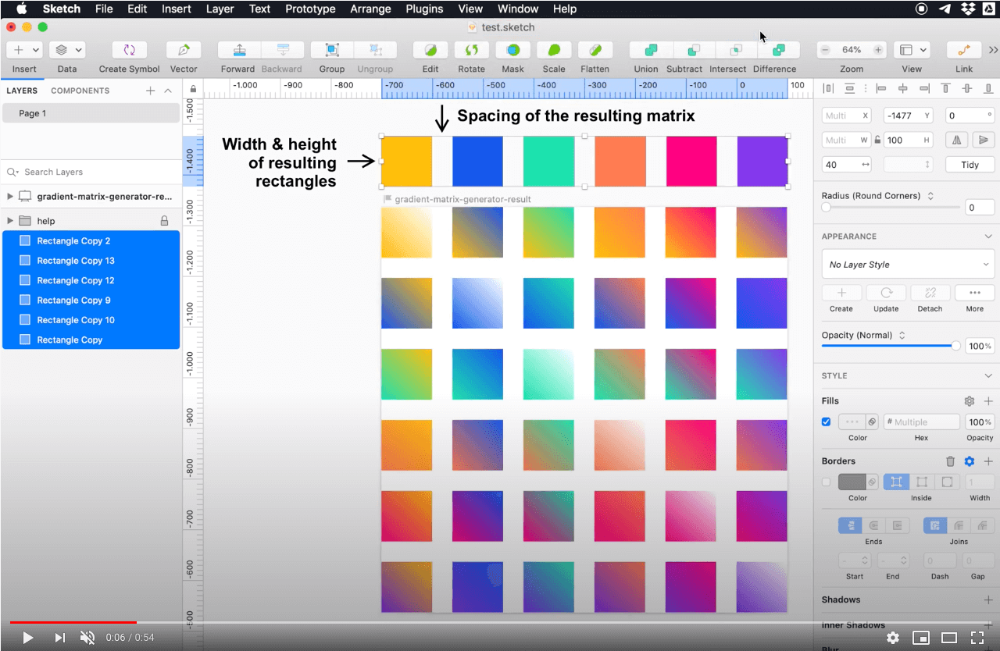

# Gradient matrix generator

## Installation

Move the Gradient Matrix Generator plugin into your Plugins folder or double-click the .sketchplugin file.

### Usage

Watch the video below (1 minute long.)

1. Draw as many rectangles as many colors you want to combine.
2. Fill them with the corresponding colors
3. Place them OUTSIDE the artboard.
4. Run the plugin the the menú option `🌈 Gradient matrix generator / Generate matrix from selection`
5. You'll get a fresh artboard with the resulting gradients.

You can take a look to the sample `test.sketch` file in this repository.

### Configuration and tweaks

- The spacing between the gradient's matrix elements will be the same as the spacing between the frist two selected elements in the selection.
- The proportions of the resulting rectangles will be the same proportions of the first element in the selection.
- You can get circles instead of squares / rectangles simply rounding the resulting shapes corners.

### Configuration and tweaks
